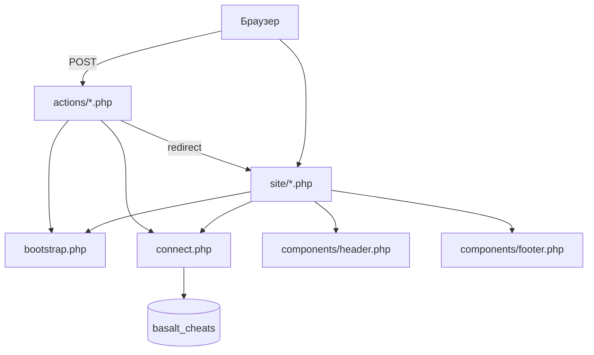

# Basalt Cheats — полное описание (education-version)

Документ для разработчика и сдачи практик: как устроена **полная** ветка `new-age/official/`, какие принципы заложены в код и за что отвечает каждый файл или связанная группа файлов.

**URL (XAMPP):** `http://localhost/new-age/official/site/`  
**DocumentRoot:** каталог `official/site/`.

См. также: [`README.md`](README.md), [`tasks.md`](tasks.md), [`PRACTICE_SOLUTIONS.md`](PRACTICE_SOLUTIONS.md), [`IMAGES.md`](IMAGES.md).

---

## 1. Принципы работы

### 1.1. Модель приложения

- **Классический PHP без фреймворка:** каждая страница — отдельный скрипт в `site/*.php`.
- **Общая инициализация** в `bootstrap.php` (сессия, конфиг, i18n, хелперы URL).
- **Подключение MySQL** через `connect.php` (и отдельные `connect_practice*.php` для учебных БД).
- **Шаблон:** `components/header.php` → контент страницы → `components/footer.php`.
- **POST-обработчики** вынесены в `site/actions/*.php` (редирект + flash-сообщения).

Нет единого front-controller: маршрут = имя файла (`games.php`, `cheat.php` и т.д.). Параметры передаются **query string** (`?game=rust&cheat=basalt-pro`), не «красивыми» путями папок — это осознанное требование каталога.

### 1.2. Цепочка покупки (магазин)

Жёсткая последовательность снижает ошибки при оплате:

```text
games.php  →  cheats.php  →  cheat.php (или plans.php)  →  checkout.php
   игры         модули          срок подписки / тариф           QR + заявка
```

- **Игра** (`games.slug`) или **OS-категория** (`os.slug`: HWID Spoofer, NFA).
- **Модуль** (`cheats.slug` в рамках игры/OS).
- **План** (`key_plans`: дни подписки или количество NFA-аккаунтов).
- **Checkout:** уникальная QR-сессия, форма контактов, запись в `payment_requests`.

Переходы строятся функцией `url_to('cheats.php', ['game' => 'rust'])` — всегда с учётом `web_base` / подпапки Apache.

### 1.3. Локализация (RU / EN)

- Язык в сессии: `?lang=ru` | `?lang=en`.
- Строки интерфейса: `lang/ru.php`, `lang/en.php` — ассоциативные массивы, доступ через `__('ключ')`.
- Контент из БД: поля `*_ru` / `*_en` (игры, читы, FAQ-блоки, `index_page`).

### 1.4. Пути и подпапка Apache

- `config/site.yaml` → `web_base` (можно пустым — тогда автоопределение из `DOCUMENT_ROOT`).
- `asset('games.php')` и `url_to()` добавляют префикс `/new-age/official/site/`.
- HTML из БД (`index_page`) проходит `fix_db_hrefs()` — относительные `href="games.php"` становятся абсолютными с префиксом.

### 1.5. Несколько баз данных

| База | Назначение |
|------|------------|
| `basalt_cheats` | Каталог, пользователи, заказы, контент витрины |
| `basalt_practice10` | Изолированные блоки для `practice10.php` |
| `db_sweetty` | Учебный сайт Sweetty (iframe ПР10) |
| `basalt_practice13` | Группы / альбомы / треки (ПР13) |

Основная логика магазина **не смешивается** с учебными дампами — только обёртки-страницы и iframe.

### 1.6. Frontend

- **CSS:** слои — `variables` → `reset` → `animations` → `base` → `layout` → `components` → `forms` → `pages`.
- **JS:** `main.js` (навигация, слайдеры, custom cursor, scroll), `network-bg.js` (canvas-фон).
- Монохромная витрина, glass-dock в шапке, плавное сворачивание меню при скролле.

---

## 2. Схема потока запроса



---

## 3. Корень `official/` (вне `site/`)

| Файл / группа | Назначение |
|---------------|------------|
| [`README.md`](README.md) | Быстрый старт, импорт SQL, список БД |
| [`FULL_EXPLANATION.md`](FULL_EXPLANATION.md) | Этот документ |
| [`tasks.md`](tasks.md) | Сверка с папкой «Задания практик» |
| [`PRACTICE_SOLUTIONS.md`](PRACTICE_SOLUTIONS.md) | Где искать код по номерам практик |
| [`IMAGES.md`](IMAGES.md) | Полный перечень путей к медиа |
| [`CHANGELOG.md`](CHANGELOG.md) | История изменений витрины |
| `DEVELOPMENT.md` | Планы и заметки разработки |
| [`Makefile`](Makefile) | `lint`, `docker compose`, импорт SQL |
| [`docker-compose.yml`](docker-compose.yml) | Web + MySQL для локальной разработки |
| `Dockerfile` | Образ PHP-Apache для compose |
| `.env.example` | Пример переменных окружения (если есть) |

---

## 4. Ядро `site/` — инфраструктура

### 4.1. `bootstrap.php`

**Центр приложения.** Подключается первым на каждой странице.

- Константы: `ROOT_PATH`, `COMPONENTS_PATH`, `CONFIG_PATH`, `LANG_PATH`.
- Старт сессии PHP.
- `site_config()` — парсинг `config/site.yaml`.
- Выбор языка, загрузка `lang/{ru|en}.php`, функция `__()`.
- Экранирование `h()`, flash-сообщения, cookies «Запомнить меня».
- `asset()`, `url_to()`, `redirect()`, `base_url_prefix()`.
- `fix_db_hrefs()` для HTML из БД.
- `nav_active_id()`, `nav_class()` — подсветка пункта меню.
- `current_user()`, `set_session_user()`, `maybe_restore_user_from_remember()`.
- `has_admin_access()` — проверка токена админки.

### 4.2. Группа подключений к БД

| Файл | Config | База |
|------|--------|------|
| [`connect.php`](site/connect.php) | `config/database.php` | `basalt_cheats` |
| [`connect_practice.php`](site/connect_practice.php) | `config/database_practice.php` | `basalt_practice10` |
| [`practice10-sweetty/connect.php`](site/practice10-sweetty/connect.php) | `config/database_sweetty.php` | `db_sweetty` |
| [`connect_practice13.php`](site/connect_practice13.php) | `config/database_practice13.php` | `basalt_practice13` |

`connect.php` создаёт `$mysqli`, при необходимости таблицу `user_auth_tokens`, вызывает восстановление сессии по cookie.

### 4.3. `config/`

| Файл | Назначение |
|------|------------|
| [`site.yaml`](site/config/site.yaml) | Бренд, Telegram, реквизиты, `web_base`, пути логотипа |
| [`database.php`](site/config/database.php) | host, port, user, pass, name — из env или дефолты XAMPP |
| `database_practice.php`, `database_sweetty.php`, `database_practice13.php` | Учебные БД |

### 4.4. `lang/ru.php`, `lang/en.php`

Пары ключ → строка для всего UI: навигация, магазин, checkout, FAQ, поддержка, аккаунт, практики.  
Страницы должны использовать `__()`, а не хардкод (кроме редкого SEO-текста через `index.seo_lead` и т.п.).

### 4.5. `components/` — общий каркас

| Файл | Назначение |
|------|------------|
| [`header.php`](site/components/header.php) | `<html>`, CSS, фон (orbs + canvas), glass-dock nav, язык, Telegram, аккаунт, выпадающее меню «⋯» |
| [`footer.php`](site/components/footer.php) | Подвал, ссылки на игры, скрипты `network-bg.js` + `main.js` |
| [`breadcrumbs.php`](site/components/breadcrumbs.php) | Хлебные крошки (массив `$breadcrumbs` задаёт страница) |

### 4.6. [`.htaccess`](site/.htaccess)

`RewriteBase /new-age/official/site/` — для корректных относительных путей mod_rewrite.

---

## 5. Магазин — страницы каталога

| Файл | Роль |
|------|------|
| [`games.php`](site/games.php) | Список игр + OS-категории из таблиц `games`, `os` |
| [`cheats.php`](site/cheats.php) | Модули по `?game=` или `?os=`; кнопка «Подробнее» → `cheat.php` |
| [`cheat.php`](site/cheat.php) | Карточка модуля: слайдер альбома 16:9 (`cheat_media`), выбор плана, переход на checkout |
| [`plans.php`](site/plans.php) | Альтернативный шаг выбора срока подписки (если нужен отдельный экран) |
| [`checkout.php`](site/checkout.php) | Итог заказа, QR (внешний API), форма «Я оплатил» |

**Данные:** `cheats`, `key_plans`, `cheat_media`, `cheat_features`, `cheat_requirements`.  
**Альбомы:** `assets/img/cheats/albums/{slug}-01.png` … `-03.png` (см. `IMAGES.md`).

---

## 6. Витрина и контент

| Файл | Роль |
|------|------|
| [`index.php`](site/index.php) | Главная: hero, преимущества, игры из БД, SEO-блок; **не** дублирует весь `index_page` |
| [`index-db-blocks.php`](site/index-db-blocks.php) | ПР9: вывод **всех** строк `index_page` подряд (учебная демонстрация) |
| [`faq.php`](site/faq.php) | FAQ + доверие; карта может дублировать смысл блока `map` |
| [`reviews.php`](site/reviews.php) | Отзывы / новости (`news_articles`) |
| [`chronicle.php`](site/chronicle.php) | «Блог» / статусы модулей |
| [`article.php`](site/article.php) | Одна публикация по slug |
| [`gallery.php`](site/gallery.php) | `gallery_items` |
| [`team.php`](site/team.php) | `team_members` |
| [`freebies.php`](site/freebies.php) | Раздел бесплатного / рефералок |
| [`feedback.php`](site/feedback.php) | Поддержка + форма (ПР6-подобная валидация на отдельной странице тоже есть) |
| [`regions.php`](site/regions.php), [`operations.php`](site/operations.php), [`history.php`](site/history.php) | Доп. «вселенная» витрины (контентные страницы) |

---

## 7. Аккаунт и личный кабинет

| Файл | Роль |
|------|------|
| [`user-info.php`](site/user-info.php) | Профиль: email, ник, аватар |
| [`dashboard.php`](site/dashboard.php) | «Ваши ключи» — `license_keys`, активация, заморозка |
| [`answer.php`](site/answer.php) | Страницы успеха после форм (`answer.contact_ok` и т.д.) |

### Группа `actions/` (POST)

| Файл | Действие |
|------|----------|
| `auth-login.php`, `auth-register.php`, `auth-logout.php` | Вход / регистрация / выход |
| `account-save.php`, `account-delete.php` | Профиль и удаление |
| `payment.php` | Сохранение заявки после оплаты |
| `contact.php` | Обратная связь |
| `license-action.php` | Операции с ключом в дэшборде |
| `practice10-save.php` | Запись в `basalt_practice10` |
| `admin-crud.php` | Админ-панель |
| `account-dashboard-gate.php` | Проверка доступа к дэшборду |

---

## 8. Админка

| Файл | Роль |
|------|------|
| [`admin.php`](site/admin.php) | UI просмотра/редактирования таблиц по токену `admin_access_tokens` |

---

## 9. Учебные страницы (меню «⋯»)

| Файл | Практика | Суть |
|------|----------|------|
| [`validation-lab.php`](site/validation-lab.php) | ПР6 | HTML5-валидация формы |
| [`iframe-target-lab.php`](site/iframe-target-lab.php) | ПР8 | Именованный `iframe` + `target` |
| [`runtime-demo.php`](site/runtime-demo.php) | — | Серверный vs клиентский вывод |
| [`practice10.php`](site/practice10.php) | ПР10 | Чтение/запись в `basalt_practice10` |
| [`practice10-sweetty-79.php`](site/practice10-sweetty-79.php) | ПР10 7.9 | iframe → локальный `practice10-sweetty-79/` |
| [`practice10-sweetty-710.php`](site/practice10-sweetty-710.php) | ПР10 7.10 | iframe → `practice10-sweetty/` |
| [`practice11.php`](site/practice11.php) | ПР11 | Обёртка iframe «День Победы» |
| [`practice11-cities.php`](site/practice11-cities.php) | ПР11 | Города-герои |
| [`practice12-async.php`](site/practice12-async.php) | ПР12 | Async загрузка фрагментов |
| [`practice13.php`](site/practice13.php) | ПР13 | Вкладки → iframe `practice13-music/*` |
| [`support-console.php`](site/support-console.php) | — | Несколько iframe поддержки |

### 9.1. Подпроекты внутри `site/`

**`practice10-sweetty/`** — копия учебного Sweetty: `index.php`, `add_feedback.php`, `inc/header.php`, `inc/footer.php`, загрузки в `upload/`.

**`practice10-sweetty-79/`** — изолированная форма 7.9 с собственным `connect.php`.

**`practice11-victory/`** — мини-сайт: `index.php`, `hero-city.php`, `data.php`, `inc/nav.php`, `inc/cities-grid.php`, медиа в `assets/media/`.

**`practice12-async/`** — статический «Моя сладость»: `index.html`, `async/*/index.html`, `assets/script/async.js`.

**`practice13-music/`** — PHP-каталог музыки: `index.php` (группы), `albums.php`, `tracks.php`, `inc/layout-top.php`, `inc/layout-bottom.php` (без дублирующей nav внутри iframe).

---

## 10. База данных — `site/database/`

| Файл | Назначение |
|------|------------|
| [`FULL.sql`](site/database/FULL.sql) | **Полный импорт:** все четыре БД (сброс + main + PR10 + Sweetty + PR13) |
| [`basalt_cheats.sql`](site/database/basalt_cheats.sql) | Только `basalt_cheats`: схема + seed |
| [`practice10.sql`](site/database/practice10.sql) | Только `basalt_practice10` |
| [`db_sweetty.sql`](site/database/db_sweetty.sql) | Только `db_sweetty` |
| [`practice13.sql`](site/database/practice13.sql) | Только `basalt_practice13` |

Ключевые таблицы магазина: `games`, `os`, `cheats`, `key_plans`, `cheat_media`, `payment_requests`, `users`, `license_keys`, `index_page`.

---

## 11. Статика — `site/assets/`

### CSS (подключаются из `header.php` по порядку)

| Файл | Зона ответственности |
|------|---------------------|
| `variables.css` | CSS-переменные (цвета, радиусы, шрифты) |
| `reset.css` | Нормализация |
| `animations.css` | Keyframes, переходы |
| `base.css` | body, фон, типографика, custom cursor |
| `layout.css` | Сетка, header/footer, glass-dock, scroll progress |
| `components.css` | Карточки, слайдер чита 16:9, каталог |
| `forms.css` | Поля, custom select, модалка аккаунта |
| `pages.css` | Специфика отдельных страниц |

### JavaScript

| Файл | Назначение |
|------|------------|
| [`main.js`](site/assets/js/main.js) | Nav expand/collapse, cheat slider, custom cursor (в т.ч. скрытие над iframe), поиск, back-to-top |
| [`network-bg.js`](site/assets/js/network-bg.js) | Анимированный canvas на фоне |

### `assets/svg/`

Иконки UI: стрелки, chevron, search, close, more-horizontal — используются в шапке, слайдере, формах.

### `assets/img/`

Структура описана в [`IMAGES.md`](IMAGES.md): игры, обложки читов, альбомы PNG, галерея, команда, компоненты.

---

## 12. Прочее в `site/`

| Файл | Назначение |
|------|------------|
| [`GITHUB_NOTES.md`](site/GITHUB_NOTES.md) | Заметки для публикации на GitHub |

---

## 13. Типичные сценарии отладки

1. **Белая страница / 503** — проверить `config/database.php`, импорт `basalt_cheats.sql`, запущен ли MySQL.
2. **Сломанные картинки / CSS** — проверить `web_base` и `.htaccess` RewriteBase.
3. **Пустой каталог** — таблицы `games` / `cheats` пусты или `is_enabled = 0`.
4. **Слайдер без картинок** — положить PNG в `assets/img/cheats/albums/` или переимпортировать `cheat_media`.
5. **Практика 10/13** — импортировать **отдельные** SQL и configs, не только основную БД.

---

## 14. Связь с edu-версией

Упрощённая копия для учебных целей: [`../edu/FULL_EXPLANATION.md`](../edu/FULL_EXPLANATION.md).  
Там один CSS, без network-bg/cursor, БД `basalt_cheats_edu`, урезанное меню «⋯».
